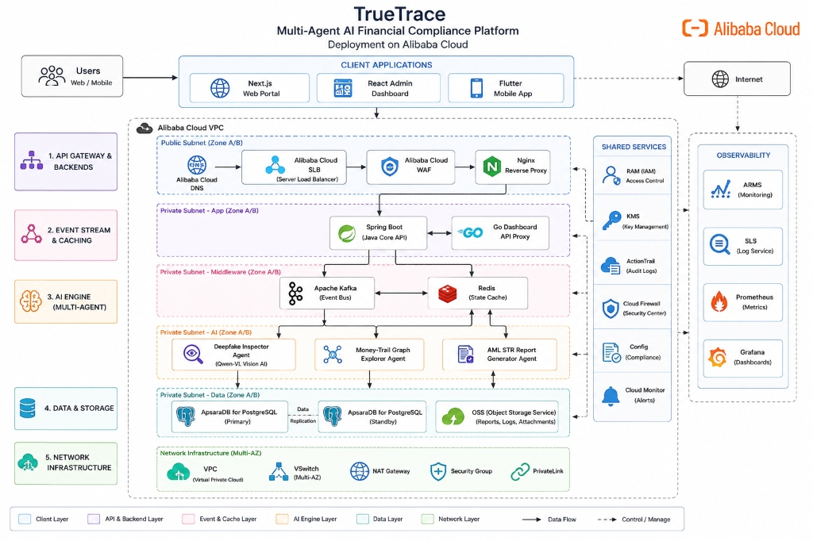
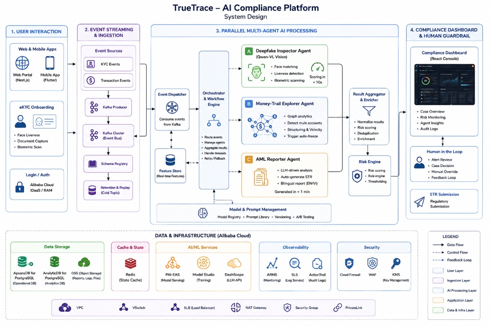
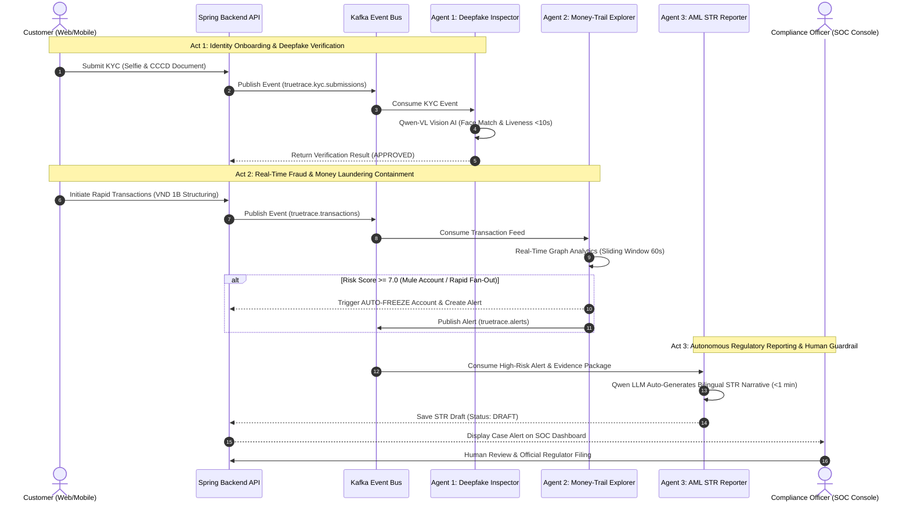

# TrueTrace: Multi-Agent Deepfake & AML Autonomous Compliance System

<p align="center">
  
  
  
</p>

<p align="center">
  
  
  
  
  
  
  
  
  
  
  
</p>

> **Built with [Qoder](https://qoder.com)** -- AI-Powered Spec-Driven Development
> [Development Specs & Prompts](SPEC.md) | [Architecture](docs/ARCHITECTURE.md) | [Test Matrix](docs/TESTING.md) | [Production Readiness](docs/PRODUCTION-READINESS.md)

---

## What is TrueTrace?

TrueTrace is a next-generation **autonomous compliance platform** designed for banks and financial institutions. It automates three critical compliance workflows using a collaborative Multi-Agent AI system:

| Agent | Problem Solved | How It Works |
|-------|---------------|-------------|
| **Deepfake Inspector** | Fraudulent identity during eKYC onboarding | AI Vision analyzes selfies & ID documents, detects deepfakes with Alibaba Qwen-VL, auto-approves or rejects in **< 10 seconds** |
| **Money-Trail Explorer** | Money laundering via mule accounts, structuring, circular flows | Builds real-time transaction graph, detects **6 AML patterns** simultaneously, **auto-freezes** accounts when risk > threshold |
| **AML Report Generator** | Manual STR report writing (2-4 hours per report) | LLM generates bilingual (English/Vietnamese) Suspicious Transaction Reports in **< 1 minute**, ready for human review |

> **Production guardrail**: TrueTrace provides decision support. AI findings are not
> legal conclusions, and STR submission always requires an authorized human reviewer.

---

## System Architecture

TrueTrace utilizes a multi-zone, event-driven enterprise architecture deployed on **Alibaba Cloud**, powered by Apache Kafka, Redis, ApsaraDB for PostgreSQL, and Alibaba Cloud AI services (Qwen-VL, DashScope LLM API):



### Multi-Tier Architecture Breakdown

- **Client Applications**: Next.js Web Portal, React Admin Dashboard (SOC Console), Flutter Mobile Banking App.
- **API Gateway & Backends (Public & App Subnets)**: Alibaba Cloud DNS $\rightarrow$ SLB $\rightarrow$ WAF $\rightarrow$ Nginx Reverse Proxy routing to **Spring Boot (Java 17 Core Banking API)** and **Go Dashboard API Proxy**.
- **Event Stream & Caching (Middleware Subnet)**: **Apache Kafka** event streaming bus for real-time KYC/transaction feeds and **Redis** for state caching and agent locks.
- **Multi-Agent AI Engine (AI Subnet)**:
  - **Deepfake Inspector Agent**: Qwen-VL Vision AI for eKYC face matching, liveness detection, and document verification (< 10s).
  - **Money-Trail Graph Explorer Agent**: Real-time graph analytics detecting mule accounts, velocity anomalies, circular flows, and structuring with automated freeze triggers.
  - **AML STR Report Generator Agent**: LLM-driven bilingual (EN/VI) Suspicious Transaction Report generator (< 1 min).
- **Data & Storage (Data Subnet)**: **ApsaraDB for PostgreSQL** (Primary & Standby with replication) and **Alibaba Cloud OSS** for evidence and STR report storage.
- **Shared Services & Observability**: RAM (IAM), KMS, ActionTrail, Cloud Firewall, ARMS Monitoring, SLS Log Service, Prometheus, and Grafana.

---

## System Design & Data Flow

The platform executes an end-to-end data processing and multi-agent orchestration workflow:



### Pipeline Stages

1. **User Interaction**: Users onboarding via Web/Mobile apps submit eKYC photo/video or initiate financial transactions.
2. **Event Streaming & Ingestion**: Kafka Producers publish KYC & Transaction events into the Kafka Cluster, supported by Schema Registry and Retention & Replay cold topic storage.
3. **Parallel Multi-Agent AI Processing**:
   - **Event Dispatcher & Feature Store**: Routes real-time features and event feeds to the Orchestrator & Workflow Engine.
   - **3 Autonomous Agents**: Deepfake Inspector (Qwen-VL), Money-Trail Explorer (Graph analytics), and AML Reporter (LLM narrative).
   - **Result Aggregator & Risk Engine**: Normalizes results, performs risk scoring, deduplication, and threshold evaluation.
4. **Compliance Dashboard & Human Guardrail**: React Compliance Console for human-in-the-loop review, case decisions, manual overrides, and authorized STR regulatory submissions.
5. **Alibaba Cloud Infrastructure & Storage**: Integrated with ApsaraDB for PostgreSQL, AnalyticDB, OSS, Redis, PAI-EAS, Model Studio (Qwen LLM API), ARMS, SLS, and WAF security.

---

## Project Directory Structure

The TrueTrace project workspace contains the following components:

| Directory | Language / Tech Stack | Description |
|---|---|---|
| **truetrace-backend** | Java 17 / Spring Boot / Maven | Core banking ledger, accounts management, transaction posting, and compliance API endpoints. |
| **truetrace-agent-engine** | Python 3 / Kafka / Redis | Multi-Agent orchestrator that coordinates Python agents listening to Kafka compliance events. |
| **agent-deepfake-inspector** | Python / Vision LLM Prompt | Prompt configuration and validation schemas for the Deepfake KYC validation agent. |
| **agent-money-trail** | Python / Graph Prompt | Prompt configuration and heuristics for tracking structuring, velocity, and mule-account flows. |
| **agent-aml-reporter** | Python / LLM Text Generator | Prompt configuration for writing official, regulatory-compliant Suspicious Transaction Reports (STR). |
| **truetrace-dashboard** | React 19 / TypeScript / Go | Compliance admin console for bank officers to audit KYC sessions, AML alerts, and STRs. |
| **truetrace-web-client** | Next.js Standalone / Node 20 | Customer portal enabling users to log in, transfer money, and submit KYC videos. |
| **truetrace-mobile-app** | Flutter 3 / Dart | Customer mobile banking application showing transactions, transfer forms, and balances. |
| **truetrace-deployment** | Docker Compose / Helm / K8s | Container orchestration scripts and gateway configurations for local and cluster deployments. |
| **truetrace-terraform** | HCL / Terraform | Cloud infrastructure deployment definitions targeting AWS (ECS, RDS, MSK, ElastiCache, WAF). |

---

## Quick Start

### Prerequisites

- **Docker Desktop** (v4.x+) installed and running
- **Git** installed
- At least **8 GB RAM** allocated to Docker (Settings > Resources)

### 1. Clone the repository (with all submodules)

```bash
git clone --recursive https://github.com/Little-Boy-s-TrueTrace/truetrace.git
cd truetrace
```

> If you already cloned without `--recursive`, run:
> ```bash
> git submodule update --init --recursive
> ```

### 2. Configure environment and start

```bash
cd truetrace-deployment
cp .env.example .env
docker compose up --build -d --wait
```

First build takes 5-10 minutes. Wait for all containers to be healthy:

```bash
docker compose ps
```

You should see 10 long-running containers healthy. `kafka-init` is a one-shot
container and should show `Exited (0)` after creating the six topics.

### 3. Access the platform

All services are accessed through the Nginx gateway on port 80:

| Service | URL | Credentials |
|---------|-----|-------------|
| **Customer Portal** | http://localhost | Register a new account |
| **Compliance Dashboard** | http://localhost/soc/ | OTP login with operator UID `10001` |
| **Banking API** | http://localhost/api-bank/ | -- |
| **Dashboard API** | http://localhost/api/ | -- |
| **Kafka UI (Kafdrop)** | http://localhost:9000 | -- |

### 4. Run the demo

Run the deterministic verifier once before recording:

```bash
cd ..
python truetrace-deployment/scripts/full_stack_smoke.py
```

It creates run-specific accounts, requires KYC approval before every source
account can transfer, verifies Kafka offsets and PostgreSQL rows, and prints a
fresh customer/recipient pair for two live structuring transfers. The second
near-threshold transfer crosses the repeated-structuring rule and produces a
freeze, AML alert, and linked draft STR. Pre-login the dashboard with its
one-time token before recording. Follow
[`docs/DEMO-RUNBOOK.md`](docs/DEMO-RUNBOOK.md) for the exact sequence.

### Troubleshooting

```bash
# View logs for a specific service
docker compose logs -f backend
docker compose logs -f agent-engine

# Restart everything
docker compose down -v
docker compose up --build -d

# Check if backend is healthy
curl http://localhost/api-bank/health
```

---

## Security & Compliance Safeguards

1. **Internal Token Sync**: All internal microservice-to-microservice REST communications are authenticated using `TRUETRACE_SECURITY_SYNC_TOKEN`.
2. **Log Sanitization**: Core backend service logs are configured to automatically strip credit card numbers, password terms, and JWT secrets to comply with PCI-DSS regulations.
3. **Mule Account Containment**: The Money-Trail Agent automatically blocks target accounts and pauses pending transfers if anomaly thresholds (>7.0 score) are triggered.

---

## Demo Scenario: End-to-End Compliance Pipeline

TrueTrace orchestrates a seamless, multi-agent compliance workflow from onboarding identity protection to real-time asset containment and automated regulatory filing:



### Detailed Pipeline Breakdown

| Act | Stage & Focus | Trigger & Input | AI & Engine Action | Automated Result | Latency |
|:---:|:---|:---|:---|:---|:---:|
| **Act 1** | **Identity Onboarding**<br/>*(Deepfake Inspector)* | Selfie photo & Citizen ID (CCCD) upload | **Qwen-VL Vision AI** evaluates face match, document integrity, and liveness scoring. | Auto **`APPROVE`**, **`REJECT`**, or escalate to **`MANUAL_REVIEW`** | **< 10s** |
| **Act 2** | **AML Containment**<br/>*(Money-Trail Explorer)* | High-velocity transactions (e.g. 1B VND to 20 targets in 60s) | **Graph Analytics Engine** tracks 6 laundering patterns (Mule dispersion, Structuring, Circular flow). | **Auto-Freeze Account** + Generate high-priority AML alert ($Score \ge 7.0$) | **Real-Time** |
| **Act 3** | **Regulatory Reporting**<br/>*(AML STR Reporter)* | High-risk alert & complete evidence payload | **Qwen LLM Narrative Generator** compiles bilingual (EN/VI) Suspicious Transaction Report. | Save **`DRAFT` STR** on SOC Dashboard ready for human review & submission | **< 1 min** |

> [!TIP]
> **Autonomous Compliance Transformation**: Traditional banking compliance requires **2 to 4 hours** per manual STR report. TrueTrace reduces the end-to-end cycle—from fraud containment to regulatory filing—to just **seconds** with strict **Human-in-the-Loop** review boundaries.

### AML Detection Patterns

| Pattern | Risk Points | Description |
|---------|:-----------:|-------------|
| Fan-out | +4 | One sender to many recipients |
| Fan-in | +4 | Many senders to one recipient |
| Circular Flow | +6 | Cycle detection up to 5 hops (A-B-C-A) |
| Velocity Anomaly | +3 | High transaction volume within 1 hour |
| Structuring | +5 | Amounts just beneath reporting limits |
| Rapid Mule Dispersion | +8 | Immediate forwarding of received funds |

---

## Hackathon

**Alibaba Cloud & Qoder Hackathon HCMC -- FSI (Financial Services Industry)**

- **Track**: BUILD (Developer Track)
- **Team**: Little Boy's
- **Built with**: [Qoder](https://qoder.com) Spec-Driven AI Development
- **AI Provider**: Alibaba Cloud Model Studio (Qwen-VL, Qwen-Plus)

See [SPEC.md](SPEC.md) for the complete Qoder development workflow and prompts used to build TrueTrace.

---

## License

This project is developed for the Alibaba Cloud & Qoder Hackathon HCMC 2026.
