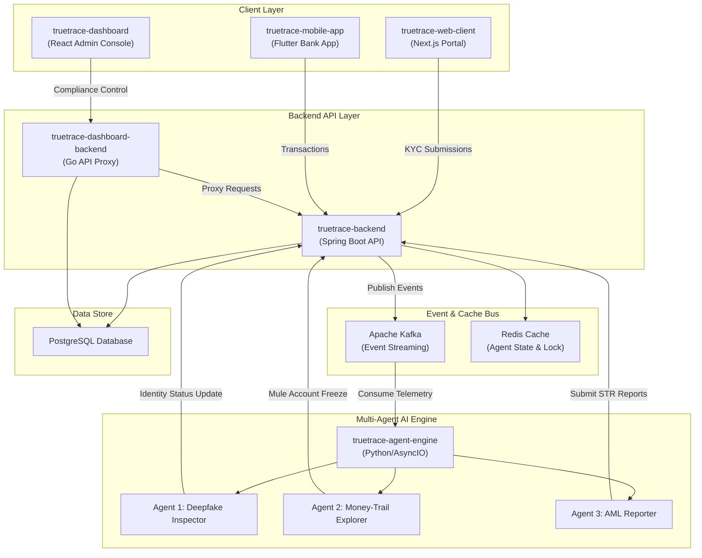

# TrueTrace: Multi-Agent Deepfake & AML Autonomous Compliance System

TrueTrace is a next-generation autonomous compliance platform designed for banks and financial institutions to automate AML (Anti-Money Laundering) checks, KYC (Know Your Customer) identity verification, and deepfake fraud detection. Powered by a collaborative Multi-Agent AI system, TrueTrace analyzes customer onboarding video/images, traces illicit money movements (mule accounts), and generates regulatory Suspicious Transaction Reports (STR) automatically.

> Production guardrail: TrueTrace provides decision support. AI findings are not
> legal conclusions, and STR submission always requires an authorized human reviewer.

Production gates and external go-live requirements: [docs/PRODUCTION-READINESS.md](docs/PRODUCTION-READINESS.md).

Detailed design: [Vietnamese architecture](docs/ARCHITECTURE.vi.md) ·
[test matrix](docs/TESTING.md)

---

## 🏗️ System Architecture

TrueTrace utilizes an event-driven architecture powered by Apache Kafka, Redis, and PostgreSQL, binding modern microservices into a unified compliance ecosystem:



---

## 📂 Project Directory Structure

The TrueTrace project workspace contains the following components:

| Directory | Language / Tech Stack | Description |
|---|---|---|
| **[truetrace-backend](file:///d:/Little%20Boy's%20TrueTrace/truetrace-backend)** | Java 17 / Spring Boot / Maven | Core banking ledger, accounts management, transaction posting, and compliance API endpoints. |
| **[truetrace-agent-engine](file:///d:/Little%20Boy's%20TrueTrace/truetrace-agent-engine)** | Python 3 / Kafka / Redis | Multi-Agent orchestrator that coordinates Python agents listening to Kafka compliance events. |
| **[agent-deepfake-inspector](file:///d:/Little%20Boy's%20TrueTrace/agent-deepfake-inspector)** | Python / Vision LLM Prompt | Prompt configuration and validation schemas for the Deepfake KYC validation agent. |
| **[agent-money-trail](file:///d:/Little%20Boy's%20TrueTrace/agent-money-trail)** | Python / Graph Prompt | Prompt configuration and heuristics for tracking structuring, velocity, and mule-account flows. |
| **[agent-aml-reporter](file:///d:/Little%20Boy's%20TrueTrace/agent-aml-reporter)** | Python / LLM Text Generator | Prompt configuration for writing official, regulatory-compliant Suspicious Transaction Reports (STR). |
| **[truetrace-dashboard](file:///d:/Little%20Boy's%20TrueTrace/truetrace-dashboard)** | React 19 / TypeScript / Go | Compliance admin console for bank officers to audit KYC sessions, AML alerts, and STRs. |
| **[truetrace-web-client](file:///d:/Little%20Boy's%20TrueTrace/truetrace-web-client)** | Next.js Standalone / Node 20 | Customer portal enabling users to log in, transfer money, and submit KYC videos. |
| **[truetrace-mobile-app](file:///d:/Little%20Boy's%20TrueTrace/truetrace-mobile-app)** | Flutter 3 / Dart | Customer mobile banking application showing transactions, transfer forms, and balances. |
| **[truetrace-deployment](file:///d:/Little%20Boy's%20TrueTrace/truetrace-deployment)** | Docker Compose / Helm / K8s | Container orchestration scripts and gateway configurations for local and cluster deployments. |
| **[truetrace-terraform](file:///d:/Little%20Boy's%20TrueTrace/truetrace-terraform)** | HCL / Terraform | Cloud infrastructure deployment definitions targeting AWS (ECS, RDS, MSK, ElastiCache, WAF). |

---

## ⚡ Quick Start

### 1. Run the entire platform locally via Docker Compose

Prerequisite: Ensure **Docker Desktop** is running. Then navigate to the deployment folder:

```bash
cd truetrace-deployment
cp .env.example .env
docker-compose up --build -d
```

Once started, the services can be accessed at:
- **Customer Portal**: <http://localhost:3000>
- **Compliance Dashboard**: <http://localhost:80/soc/> (User: `admin`, Pass: `admin123`)
- **Core Bank Backend API**: <http://localhost:8080>
- **Kafka Message Visualizer (Kafdrop)**: <http://localhost:9000>

### 2. Verify all services are healthy

```bash
docker ps
```
You should see all 10 containers in the `truetrace-` network running and marked as healthy.

---

## 🔒 Security & Compliance Safeguards

1. **Internal Token Sync**: All internal microservice-to-microservice REST communications are authenticated using `TRUETRACE_SECURITY_SYNC_TOKEN`.
2. **Log Sanitization**: Core backend service logs are configured to automatically strip credit card numbers, password terms, and JWT secrets to comply with PCI-DSS regulations.
3. **Mule Account Containment**: The Money-Trail Agent automatically blocks target accounts and pauses pending transfers if anomaly thresholds (>7.0 score) are triggered.
