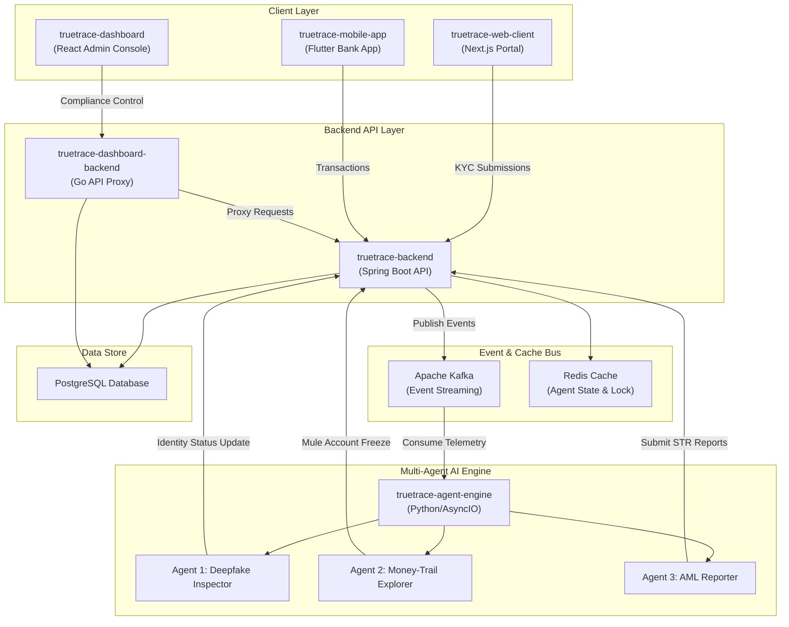

# TrueTrace: Multi-Agent Deepfake & AML Autonomous Compliance System

<p align="center">
  
  
  
</p>

<p align="center">
  
  
  
  
  
  
  
  
  
  
  
</p>

> **Built with [Qoder](https://qoder.com)** -- AI-Powered Spec-Driven Development
> [Development Specs & Prompts](SPEC.md) | [Architecture (Vietnamese)](docs/ARCHITECTURE.vi.md) | [Test Matrix](docs/TESTING.md) | [Production Readiness](docs/PRODUCTION-READINESS.md)

---

## What is TrueTrace?

TrueTrace is a next-generation **autonomous compliance platform** designed for banks and financial institutions. It automates three critical compliance workflows using a collaborative Multi-Agent AI system:

| Agent | Problem Solved | How It Works |
|-------|---------------|-------------|
| **Deepfake Inspector** | Fraudulent identity during eKYC onboarding | AI Vision analyzes selfies & ID documents, detects deepfakes with Alibaba Qwen-VL, auto-approves or rejects in **< 10 seconds** |
| **Money-Trail Explorer** | Money laundering via mule accounts, structuring, circular flows | Builds real-time transaction graph, detects **6 AML patterns** simultaneously, **auto-freezes** accounts when risk > threshold |
| **AML Report Generator** | Manual STR report writing (2-4 hours per report) | LLM generates bilingual (English/Vietnamese) Suspicious Transaction Reports in **< 1 minute**, ready for human review |

> **Production guardrail**: TrueTrace provides decision support. AI findings are not
> legal conclusions, and STR submission always requires an authorized human reviewer.

---

## System Architecture

TrueTrace utilizes an event-driven architecture powered by Apache Kafka, Redis, and PostgreSQL, binding modern microservices into a unified compliance ecosystem:



---

## Project Directory Structure

The TrueTrace project workspace contains the following components:

| Directory | Language / Tech Stack | Description |
|---|---|---|
| **truetrace-backend** | Java 17 / Spring Boot / Maven | Core banking ledger, accounts management, transaction posting, and compliance API endpoints. |
| **truetrace-agent-engine** | Python 3 / Kafka / Redis | Multi-Agent orchestrator that coordinates Python agents listening to Kafka compliance events. |
| **agent-deepfake-inspector** | Python / Vision LLM Prompt | Prompt configuration and validation schemas for the Deepfake KYC validation agent. |
| **agent-money-trail** | Python / Graph Prompt | Prompt configuration and heuristics for tracking structuring, velocity, and mule-account flows. |
| **agent-aml-reporter** | Python / LLM Text Generator | Prompt configuration for writing official, regulatory-compliant Suspicious Transaction Reports (STR). |
| **truetrace-dashboard** | React 19 / TypeScript / Go | Compliance admin console for bank officers to audit KYC sessions, AML alerts, and STRs. |
| **truetrace-web-client** | Next.js Standalone / Node 20 | Customer portal enabling users to log in, transfer money, and submit KYC videos. |
| **truetrace-mobile-app** | Flutter 3 / Dart | Customer mobile banking application showing transactions, transfer forms, and balances. |
| **truetrace-deployment** | Docker Compose / Helm / K8s | Container orchestration scripts and gateway configurations for local and cluster deployments. |
| **truetrace-terraform** | HCL / Terraform | Cloud infrastructure deployment definitions targeting AWS (ECS, RDS, MSK, ElastiCache, WAF). |

---

## Quick Start

### 1. Run the entire platform locally via Docker Compose

Prerequisite: Ensure **Docker Desktop** is running. Then navigate to the deployment folder:

```bash
cd truetrace-deployment
cp .env.example .env
docker-compose up --build -d
```

Once started, the services can be accessed at:
- **Customer Portal**: <http://localhost:3000>
- **Compliance Dashboard**: <http://localhost:80/soc/> (User: `admin`, Pass: `admin123`)
- **Core Bank Backend API**: <http://localhost:8080>
- **Kafka Message Visualizer (Kafdrop)**: <http://localhost:9000>

### 2. Verify all services are healthy

```bash
docker ps
```
You should see all 10 containers in the `truetrace-` network running and marked as healthy.

---

## Security & Compliance Safeguards

1. **Internal Token Sync**: All internal microservice-to-microservice REST communications are authenticated using `TRUETRACE_SECURITY_SYNC_TOKEN`.
2. **Log Sanitization**: Core backend service logs are configured to automatically strip credit card numbers, password terms, and JWT secrets to comply with PCI-DSS regulations.
3. **Mule Account Containment**: The Money-Trail Agent automatically blocks target accounts and pauses pending transfers if anomaly thresholds (>7.0 score) are triggered.

---

## Demo Scenario: End-to-End Compliance Pipeline

The following walkthrough demonstrates all 3 agents working in sequence:

### Act 1: Deepfake Detection (Agent 1)
```
Customer Portal --> Submit KYC (selfie + CCCD photos)
    | Kafka: truetrace.kyc.submissions
Agent 1 --> AI Vision analysis --> Auto APPROVE / REJECT / MANUAL_REVIEW
    |
Dashboard --> KYC Center shows result with deepfake & face-match scores
```

### Act 2: Money Laundering Detection (Agent 2)
```
Customer Portal --> Transfer money 3-4 times rapidly (within 60s)
    | Kafka: truetrace.transactions
Agent 2 --> Transaction graph analysis --> Detect velocity anomaly / mule split
    | Risk score >= 7.0
Backend --> AUTO-FREEZE source account + Create AML Alert
    |
Dashboard --> AML Alerts tab shows new alert with risk breakdown
```

### Act 3: Automated STR Report (Agent 3)
```
Agent 2 --> Publishes high-risk alert
    | Kafka: truetrace.alerts
Agent 3 --> LLM generates bilingual narrative (EN/VI)
    |
Backend --> Creates DRAFT STR Report
    |
Dashboard --> STR Reports tab shows report ready for human review
```

> **Key Insight**: All 3 agents work as an autonomous pipeline -- from fraud detection to account containment to regulatory reporting -- in **seconds** instead of **days**.

### AML Detection Patterns

| Pattern | Risk Points | Description |
|---------|:-----------:|-------------|
| Fan-out | +4 | One sender to many recipients |
| Fan-in | +4 | Many senders to one recipient |
| Circular Flow | +6 | Cycle detection up to 5 hops (A-B-C-A) |
| Velocity Anomaly | +3 | High transaction volume within 1 hour |
| Structuring | +5 | Amounts just beneath reporting limits |
| Rapid Mule Dispersion | +8 | Immediate forwarding of received funds |

---

## Hackathon

**Alibaba Cloud & Qoder Hackathon HCMC -- FSI (Financial Services Industry)**

- **Track**: BUILD (Developer Track)
- **Team**: Little Boy's
- **Built with**: [Qoder](https://qoder.com) Spec-Driven AI Development
- **AI Provider**: Alibaba Cloud Model Studio (Qwen-VL, Qwen-Plus)

See [SPEC.md](SPEC.md) for the complete Qoder development workflow and prompts used to build TrueTrace.

---

## License

This project is developed for the Alibaba Cloud & Qoder Hackathon HCMC 2026.
