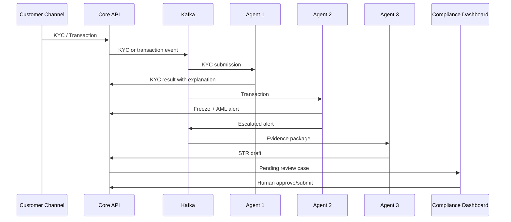

# TrueTrace Architecture

TrueTrace is a compliance decision-support system for banks. Three independent agents communicate via Kafka; every action leaves structured evidence. The system does not treat model outputs as legal conclusions and does not submit STRs to regulators automatically.

## Standard Business Flow

1. Customer submits full name, CCCD (Citizen Identity Card), selfie, and front/back photos of the ID document.
2. Backend creates a KYC session, saves evidence references, and publishes an event to `truetrace.kyc.submissions`.
3. Fraud Context & Deepfake Inspector:
   - validates CCCD structure;
   - cross-references the national identity API if configured;
   - calls Alibaba Model Studio/Qwen-VL or Alibaba eKYC gateway;
   - returns deepfake score, face-match score, liveness score, explanation signals, and recommendation.
4. Every posted transaction is published to `truetrace.transactions`.
5. Money-Trail Graph Explorer maintains a sliding-window transaction graph and detects fan-in, fan-out, circular flows, velocity anomalies, structuring, and rapid mule dispersion.
6. When the risk score reaches the threshold, the agent requests the backend to freeze the account, creates an AML alert, and publishes to `truetrace.alerts`.
7. Autonomous AML Report Generator uses Qwen to create a bilingual narrative from the evidence package. The report is saved with `DRAFT` status; an AML officer must review and submit it.

## Default Detection Policies

| Policy | Default | Description |
|---|---:|---|
| Graph window | 60 seconds | Observation window for rapid movement |
| Minimum inflow | 1,000,000,000 VND | Minimum incoming fund size |
| Minimum target count | 20 | Typical fan-out of a mule account |
| Dispersion ratio | 80% | Outflow / inflow within the window |
| Freeze threshold | 7/10 | Creates alert, freeze, and STR draft |
| Deepfake review | 0.50 | Escalates to manual review |
| Deepfake reject | 0.80 | Blocks onboarding |

All thresholds are configurable via environment variables. Banks must calibrate using historical data, risk appetite, and their own regulatory processes.

## Safety Boundaries

- Demo mode is a deterministic simulation, clearly labeled, and must not be used as a fraud conclusion.
- Raw biometrics only travel in short-lived processing events; the application database stores evidence references instead of image payloads.
- The national CCCD adapter is a hypothetical API contract and does not impersonate real connections.
- The LLM writes only from the evidence package and is instructed not to fabricate facts.
- Account freezing is a reversible internal action; STR submission always requires human approval.
- All secrets are passed via environment/secret manager and are never committed to Git.

## Repository Map

- `truetrace-backend`: Ledger, KYC/AML/STR API, and Kafka publisher.
- `truetrace-agent-engine`: Runtime for the three agents and Alibaba/Qwen adapters.
- `agent-*`: Policy pack, prompt, schema, and administration documentation for each agent.
- `truetrace-dashboard`: Command center for compliance officers.
- `truetrace-web-client`, `truetrace-mobile-app`: Two customer channels.
- `truetrace-deployment`: Docker Compose, Kubernetes, and Helm.
- `truetrace-terraform`: Cloud infrastructure.

No chatbot or legacy SOAR engine exists in the runtime; redundant Java entrypoints have been removed and the root repository has restored `.gitmodules` for correct recursive cloning.
