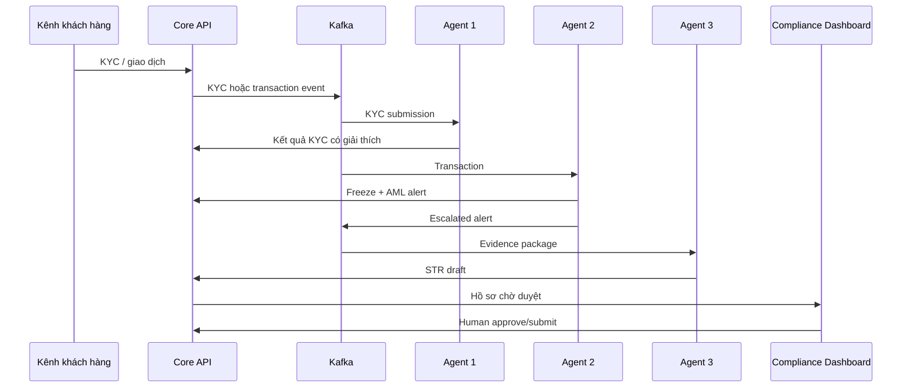

# Kiến trúc TrueTrace

TrueTrace là hệ thống hỗ trợ quyết định tuân thủ cho ngân hàng. Ba agent độc lập trao
đổi qua Kafka; mọi hành động đều để lại bằng chứng có cấu trúc. Hệ thống không coi
đầu ra mô hình là kết luận pháp lý và không tự gửi STR ra cơ quan quản lý.

## Luồng nghiệp vụ chuẩn

1. Khách hàng gửi họ tên, CCCD, ảnh selfie và hai mặt giấy tờ.
2. Backend tạo KYC session, lưu tham chiếu chứng cứ và phát sự kiện
   `truetrace.kyc.submissions`.
3. Fraud Context & Deepfake Inspector:
   - kiểm tra cấu trúc CCCD;
   - đối chiếu API định danh quốc gia nếu được cấu hình;
   - gọi Alibaba Model Studio/Qwen-VL hoặc Alibaba eKYC gateway;
   - trả điểm deepfake, face-match, liveness, tín hiệu giải thích và khuyến nghị.
4. Mỗi giao dịch đã ghi sổ được phát lên `truetrace.transactions`.
5. Money-Trail Graph Explorer duy trì đồ thị cửa sổ trượt và phát hiện fan-in,
   fan-out, vòng tròn, velocity, structuring và rapid mule dispersion.
6. Khi điểm rủi ro đạt ngưỡng, agent yêu cầu backend đóng băng tài khoản, tạo AML
   alert và phát `truetrace.alerts`.
7. Autonomous AML Report Generator dùng Qwen tạo bản tường thuật song ngữ từ đúng
   gói chứng cứ. Báo cáo được lưu dưới trạng thái `DRAFT`; chuyên viên AML phải rà
   soát và bấm gửi.

## Chính sách phát hiện mặc định

| Chính sách | Mặc định | Ý nghĩa |
|---|---:|---|
| Cửa sổ đồ thị | 60 giây | Khoảng quan sát rapid movement |
| Inflow tối thiểu | 1.000.000.000 VND | Kích thước dòng tiền đầu vào |
| Số đích tối thiểu | 20 | Fan-out điển hình của mule account |
| Tỷ lệ tẩu tán | 80% | Outflow / inflow trong cửa sổ |
| Ngưỡng đóng băng | 7/10 | Tạo alert, freeze và STR draft |
| Deepfake review | 0,50 | Chuyển kiểm tra thủ công |
| Deepfake reject | 0,80 | Chặn onboarding |

Tất cả ngưỡng được cấu hình qua biến môi trường. Ngân hàng phải hiệu chỉnh bằng dữ
liệu lịch sử, khẩu vị rủi ro và quy trình pháp chế của chính mình.

## Ranh giới an toàn

- Demo mode là mô phỏng xác định, được gắn nhãn rõ và không được dùng làm kết luận.
- Raw biometric chỉ đi trong sự kiện xử lý ngắn hạn; database ứng dụng lưu tham
  chiếu chứng cứ thay vì payload ảnh.
- Adapter CCCD quốc gia là hợp đồng API giả định, không giả mạo kết nối thật.
- LLM chỉ viết từ evidence package, được nhắc không bịa dữ kiện.
- Đóng băng là hành động nội bộ có thể đảo ngược; gửi STR luôn cần người duyệt.
- Mọi secret được truyền qua environment/secret manager, không commit vào Git.

## Bản đồ repository

- `truetrace-backend`: sổ cái, KYC/AML/STR API và Kafka publisher.
- `truetrace-agent-engine`: runtime của ba agent và adapter Alibaba/Qwen.
- `agent-*`: policy pack, prompt, schema và tài liệu quản trị từng agent.
- `truetrace-dashboard`: command center cho chuyên viên tuân thủ.
- `truetrace-web-client`, `truetrace-mobile-app`: hai kênh khách hàng.
- `truetrace-deployment`: Docker Compose, Kubernetes và Helm.
- `truetrace-terraform`: hạ tầng cloud.

Không có chatbot hay SOAR engine cũ trong runtime; entrypoint Java dư thừa đã được
loại bỏ và repository gốc đã khôi phục `.gitmodules` để clone đệ quy đúng.
