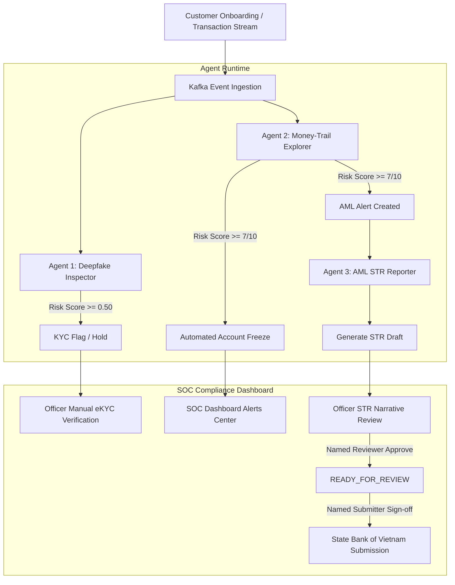

# TrueTrace Autonomous Compliance & AML Investigation Playbook

## Overview & Purpose

This Playbook serves as the official Standard Operating Procedure (SOP) for Compliance Officers, Anti-Money Laundering (AML) Analysts, and System Administrators operating **TrueTrace**—an Autonomous Multi-Agent Compliance & Investigation Platform.

TrueTrace automates identity fraud detection, real-time transaction graph analysis, and suspicious transaction report drafting while strictly enforcing a **Human-in-the-Loop (HITL)** governance framework aligned with international AML standards and State Bank of Vietnam regulations.

---

## Operational Architecture & Human-in-the-Loop Safeguards



### Safety Principles

1. **Reversible AI Actions**: Account freezing executed by Agent 2 is a temporary internal containment action. Accounts can be un-frozen directly by compliance officers after verification.
2. **Dual-Control Regulatory Submissions**: Agent 3 generates STRs exclusively in `DRAFT` status. An STR cannot be submitted to financial intelligence authorities (e.g., State Bank of Vietnam - Anti-Money Laundering Department) without explicit sign-off from a **Named Reviewer** and a **Named Submitter**.
3. **Auditability**: Every automated decision, agent confidence score, vision signal, graph anomaly metric, and human override is logged in PostgreSQL with immutable audit timestamps.

---

## Playbook 1: Deepfake Inspector & eKYC Verification (Agent 1)

### 1.1 Trigger Conditions & Agent Evaluation
Agent 1 evaluates all new eKYC onboarding submissions containing full name, Citizen Identity Card (CCCD) number/images, and liveness selfie videos/photos.

| Risk Threshold | Agent Decision | System Action | SOC Action Required |
|---|---|---|---|
| **Deepfake Score < 0.50** | **APPROVED** | Onboarding proceeds; account enabled for basic transactions. | None (Automated Clearance). |
| **0.50 <= Deepfake Score < 0.80** | **MANUAL_REVIEW** | Onboarding held in pending status; risk score flagged. | Priority review in SOC KYC Center within 2 hours. |
| **Deepfake Score >= 0.80** | **REJECTED** | Onboarding blocked; identity hash added to high-risk surveillance list. | Post-rejection audit by Compliance Manager. |

### 1.2 Investigator SOP (Standard Operating Procedure)

1. **Open SOC Dashboard -> KYC Center**: Filter by `MANUAL_REVIEW` or `REJECTED`.
2. **Inspect Vision AI Explanations**:
   - Check `liveness_score` (Target: > 0.85). Look for missing facial micro-reflections, texture smoothing, or synthetic edge artifacts.
   - Check `face_match_score` (Target: > 0.90). Compare selfie against Citizen ID avatar.
   - Check `document_tampering_score`. Inspect Citizen ID for altered fonts, background pattern distortion, missing QR code validation, or photo overlay edges.
3. **Verify Citizen ID Structure**:
   - Confirm 12-digit format matches national rules (Gender code, year of birth code, province code, random serial).
4. **Resolution Steps**:
   - **Confirm Rejection**: Click `Reject KYC`. Select reason code (e.g., `DEEPFAKE_SPOOFING`, `DOCUMENT_MANIPULATION`). Account remains disabled.
   - **Override to Approve**: If false positive confirmed (e.g., poor lighting caused low confidence), add mandatory justification note -> Click `Approve KYC`. Audit log records officer ID, timestamp, and justification.

---

## Playbook 2: Money-Trail Graph Explorer & Risk Containment (Agent 2)

### 2.1 Detection Scenarios & Automated Containment

Agent 2 analyzes real-time streaming graph transactions across sliding time windows (default: 60 seconds).

| AML Pattern | Detection Criteria | Automated Action | Risk Score |
|---|---|---|---|
| **Rapid Mule Dispersion** | Inflow >= 1,000,000,000 VND -> Outflow >= 80% to >= 20 recipient accounts within 60 seconds. | Immediate Account Freeze + Alert `RAPID_DISPERSION` | **10 / 10** |
| **Structuring / Smurfing** | Cumulative transfers >= 380,000,000 VND via multiple transactions under 200,000,000 VND (reporting threshold) within sliding window. | Immediate Account Freeze + Alert `STRUCTURING` | **7-9 / 10** |
| **Circular Money Laundering** | Transaction loop detected (Node A -> Node B -> Node C -> Node A) within observation window. | Account Freeze + Alert `CIRCULAR_FLOW` | **8 / 10** |
| **Velocity Anomaly** | Sudden 500% spike in transaction frequency and volume compared to historical baseline. | Fraud Hold + Alert `VELOCITY_SPIKE` | **7 / 10** |
| **Multi-Node Fan-In / Fan-Out** | Aggregation of funds from >10 accounts immediately forwarded to high-risk counterparty. | Account Freeze + Alert `FAN_IN_OUT` | **8 / 10** |
| **New Account Abuse** | Account age < 7 days with cumulative volume > 100,000,000 VND. | Risk Elevation + Alert `NEW_ACCOUNT_HIGH_VOL` | **7 / 10** |
| **Nighttime High-Value Anomaly** | Transactions > 50,000,000 VND initiated between 01:00 and 05:00. | Flag for Priority Review | **6 / 10** |

### 2.2 Investigator SOP (AML Alert Escalation)

1. **Receive High-Risk Alert Notification**: Access SOC Dashboard -> **AML Alerts**.
2. **Review Real-Time Transaction Graph**:
   - Inspect graph topology: Identify source account, mule nodes, and ultimate beneficiaries.
   - Validate flow metrics: Inflow volume, total outflow, time delta between transfers, number of distinct target accounts.
3. **Verify Account Status**:
   - Confirm automated freeze state (`IS_FROZEN = true`). Verify that outgoing transactions are currently blocked by Core Banking / Spring Backend.
4. **Investigative Actions**:
   - **Confirm Suspicion**: Escalate alert to Agent 3 (AML STR Reporter) for automated report generation. Keep account frozen.
   - **False Positive Unfreeze**: If transactions are legitimate corporate payroll or verified bulk disbursement:
     - Click `Unfreeze Account`.
     - Enter mandatory reason (e.g., `VERIFIED_PAYROLL_DISBURSEMENT`).
     - System updates account state to active and logs unfreeze event to Kafka and PostgreSQL.

---

## Playbook 3: Autonomous STR Drafting & Regulatory Reporting (Agent 3)

### 3.1 Report Generation & Life-Cycle Controls

Agent 3 automatically compiles evidence packages (Agent 1 eKYC visual evidence, Agent 2 graph metrics, customer profile, transaction timeline) and invokes Qwen-Plus (DashScope) to generate a structured bilingual (English/Vietnamese) Suspicious Transaction Report.

```
+------------------+      +--------------------+      +--------------------+
|  Agent 3 Drafts  | ---> | Named Officer      | ---> | Named Compliance   |
|  STR (DRAFT)     |      | Review (READY_FOR) |      | Submitter (SUBMIT) |
+------------------+      +--------------------+      +--------------------+
```

### 3.2 Report Lifecycle States

| Status | Definition | Allowed Actions |
|---|---|---|
| `DRAFT` | AI-generated preliminary report based on evidence package. | Edit narrative, add supplementary notes, transition to `READY_FOR_REVIEW`. |
| `READY_FOR_REVIEW` | Fact-checked report signed off by a Compliance Officer. | Final review by MLRO / Senior Compliance Officer, transition to `SUBMITTED` or revert to `DRAFT`. |
| `SUBMITTED` | Formally submitted to State Bank of Vietnam (SBV). Immutable audit record. | Read-only archive export (PDF/XML). |

### 3.3 Compliance Officer SOP (STR Validation & Submission)

1. **Access SOC Dashboard -> STR Reports**: Select report in `DRAFT` state linked to the high-risk alert.
2. **Fact Check AI Narrative against Evidence Package**:
   - Verify customer full name, Citizen ID, account numbers, and transaction amounts match banking ledger.
   - Ensure specific suspicious indicators (e.g., "Structuring below VND 200M", "Rapid mule fan-out of 1B VND") are explicitly detailed in both Vietnamese and English narrative sections.
   - Confirm LLM did not fabricate extra transactions or non-existent counterparties.
3. **Review & Transition**:
   - Click `Mark Ready for Review`. Enter Officer ID (`REVIEWER_ID`).
4. **Final Approval & State Bank Submission**:
   - Senior Compliance Officer reviews `READY_FOR_REVIEW` report -> Click `Submit STR`.
   - Enter Submitter ID (`SUBMITTER_ID`). Backend validates dual-control policy and archives submitted package with cryptographic hash.

---

## Playbook 4: Vietnamese Regulatory Alignment & Statutory References

TrueTrace operations strictly enforce the reporting standards and timelines established by Vietnamese AML legislation:

| Regulatory Instrument | Key Requirement / Threshold | TrueTrace Implementation |
|---|---|---|
| **Law on AML 2022 (Law No. 14/2022/QH15)** | **Article 26**: Mandates filing Suspicious Transaction Reports upon identifying red flags. | Agent 3 automatically generates bilingual STRs covering red-flag patterns. |
| **Circular 09/2023/TT-NHNN** | **Appendix Guidelines**: Specifies standardized format, fields, and 48-hour filing window post-suspicion. | Automated 48-hour SLA countdown timer on SOC Dashboard for `DRAFT` reports. |
| **CTR Thresholds** | Cash >= 300,000,000 VND; E-transfers >= 500,000,000 VND. | Auto-tracked by Agent 2 graph observer for CTR compliance export. |
| **Decree 19/2023/ND-CP** | Rules on customer due diligence (CDD) and high-risk customer classification. | Agent 1 and Agent 2 dynamic risk scoring (1-10 scale). |

---

## Playbook 5: Threshold Calibration & False Positive Mitigation SOP

### 5.1 Environment Variable Calibration Matrix

System administrators can calibrate agent sensitivity via environment variables without re-deploying code:

```env
# Agent 1 Thresholds
DEEPFAKE_REVIEW_THRESHOLD=0.50
DEEPFAKE_REJECT_THRESHOLD=0.80

# Agent 2 Thresholds
GRAPH_WINDOW_SECONDS=60
STRUCTURING_THRESHOLD_VND=380000000
RAPID_DISPERSION_MIN_INFLOW_VND=1000000000
RAPID_DISPERSION_MIN_TARGETS=20
RAPID_DISPERSION_RATIO=0.80
FREEZE_RISK_SCORE_THRESHOLD=7
```

### 5.2 Monthly False Positive Review Procedure
1. Extract monthly audit export: `SELECT * FROM aml_alerts WHERE status = 'FALSE_POSITIVE'`.
2. Compute False Positive Rate (FPR) per detection pattern.
3. If FPR for a pattern exceeds **5%**, increase the minimum volume threshold by 15% or lengthen the observation window.
4. Execute full-stack verification after updating configuration:
   `python truetrace-deployment/scripts/full_stack_smoke.py`

---

## Playbook 6: Privacy, Data Protection & System Resilience Matrix

### 6.1 Data Privacy Safeguards (Decree 13/2023/ND-CP)
- **Ephemeral Biometric Processing**: Raw image payloads and video streams are processed in-memory by Qwen-VL Vision API; database retains only cryptographic hashes (`sha256`) and extracted feature scores.
- **Role-Based Access Control (RBAC)**: Compliance dashboard enforces JWT session expiration, role separation (Officer vs. Senior MLRO), and OTP authentication.

### 6.2 Resiliency & Fault-Tolerance Protocol

| Failure Mode | Impact | Automatic Mitigation | SOP Action |
|---|---|---|---|
| **DashScope/LLM API Timeout** | Agent 3 cannot generate narrative. | Fallbacks to structured markdown template with raw evidence package. | Retry via backup regional endpoint. |
| **Kafka Broker Disconnection** | Event queue delayed. | Spring Backend buffers transaction events locally in PostgreSQL. | Restart Kafka container; events replayed automatically. |
| **Vision API 429 Rate Limit** | Agent 1 delayed. | Submission queued in Redis retry buffer with exponential backoff. | Scale Qwen-VL concurrency quota on Alibaba Cloud console. |

---

## Playbook 7: Emergency Response & System Health SOPs

### 7.1 Mass Mule Attack Containment Protocol
If a coordinated attack creates a sudden influx of mule accounts:
1. Access `truetrace-deployment` configuration.
2. Adjust Agent 2 environment variables for heightened sensitivity:
   - Lower `STRUCTURING_THRESHOLD_VND` (e.g., to 100,000,000 VND).
   - Lower `RAPID_DISPERSION_TIME_WINDOW` (e.g., to 30 seconds).
3. Restart `agent-engine` microservice (`docker compose restart agent-engine`).

### 7.2 Agent Health Check & Diagnostic Checklist
- Verify microservice status:
  `docker compose ps -a`
- Inspect agent log telemetry:
  `docker compose logs --tail=100 agent-engine backend dashboard-backend`
- Verify Kafka topic pipeline:
  `docker exec truetrace-kafka /opt/kafka/bin/kafka-topics.sh --bootstrap-server localhost:29092 --list`
- Run integration verification:
  `python truetrace-deployment/scripts/full_stack_smoke.py`

---

## Summary Table: Key Metrics & SLA Targets

| Operational Area | Target SLA | Metric Owner | Regulatory Ref |
|---|---|---|---|
| eKYC Deepfake & Liveness Check | < 10 seconds | Agent 1 (Deepfake Inspector) | Decree 19/2023/ND-CP |
| Transaction Graph Anomaly Detection | < 1 second | Agent 2 (Money-Trail Explorer) | Law on AML 2022 Art. 26 |
| Automated STR Draft Generation | < 15 seconds | Agent 3 (AML STR Reporter) | Circular 09/2023/TT-NHNN |
| STR Regulatory Submission SLA | < 48 hours | Human Compliance Officer | Circular 09/2023/TT-NHNN |
| Emergency Account Unfreeze SLA | < 15 minutes | Human Compliance Officer | Internal Bank SOP |
